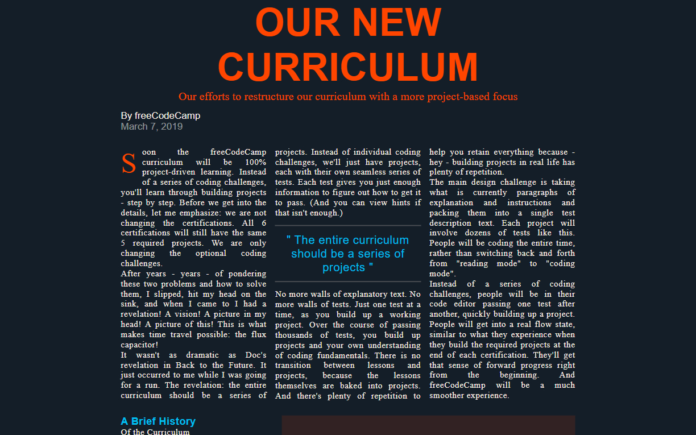

# Magazine | FCC Responsive Web Design Certification

**Project 16/20**

A modern, responsive magazine article layout built with HTML and CSS. It features a hero section, author details, social icons, rich text formatting, quote blocks, image grids, and a timeline list. Inspired by editorial design, this project focuses on structure, readability, and responsive layout techniques 🧾✨.

---

## 📚 Table of Contents

- [🔎 Overview](#-overview)
  - [📸 Screenshot](#-screenshot)
  - [🔗 Links](#-links)
  - [📌 Features](#-features)
- [🧠 My process](#-my-process)
  - [🛠️ Built with](#️-built-with)
  - [🎓 What I learned](#-what-i-learned)
  - [🔙 Previous Project](#-previous-project)
  - [🔜 Next Project](#-next-project)
- [👤 Author](#-author)
  - [🌐 Connect with Me](#-connect-with-me)
  - [💻 Coding Profiles](#-coding-profiles)

---

## 🔎 Overview

### 📸 Screenshot

### 🔗 Links

 - [🔴 Live Demo](https://dalascript.github.io/magazine/)
 - [🗂️ GitHub Repository](https://github.com/DalaScript/magazine)

### 📌 Features

 - ✅ Hero section with featured image and heading
 - ✅ Author info and publish date
 - ✅ Responsive layout using CSS Grid
 - ✅ Text formatting with styled first-letter, quotes, and blockquotes
 - ✅ Timeline list with styled subtitles
 - ✅ Image gallery with captions

## 🧠 My Process

### 🛠️ Built with

 - HTML5
 - CSS3

### 🎓 What I Learned

 - How to build an editorial-style layout with semantic HTML
 - Structuring content with CSS Grid and making it responsive
 - Styling article elements like blockquotes, first-letter effects, and lists
 - Creating image layouts that adapt to different screen sizes
 - Using object-fit, font pairing, and spacing for clean readability
 - Implementing a professional design system with reusable classes

  > 🚀 For me, this project was more about **practice** and gaining additional **experience**,  
  > rather than learning something entirely new.  
  >  
  > 👨‍💻 Since I’m not a beginner and already familiar with these technologies,  
  > I approached it with confidence — and still, I truly **enjoyed working on it**.  
  >  
  > 🎯 Overall, I consider this a very **valuable and enjoyable experience**.

### 🔙 Previous Project

 - City Skyline | *[Project 15/20]* → [View Repository](https://github.com/DalaScript/city-skyline)

### 🔜 Next Project

 - Product Landing Page *(Certification Project)* | *[Project 17/20]* → [View Repository](https://github.com/DalaScript/product-landing-page)

---

## 👤 Author

### 🌐 Connect with Me

 - [Instagram](https://www.instagram.com/DalaScript)
 - [YouTube](https://www.youtube.com/@DalaScript)

### 💻 Coding Profiles

 - [freeCodeCamp](https://www.freecodecamp.org/DalaScript)
 - [FrontendMentor](https://www.frontendmentor.io/profile/DalaScript)
 - [GitHub](https://github.com/DalaScript)

*🙌 Thanks for checking out my project! More coming soon. Stay tuned 🚀*